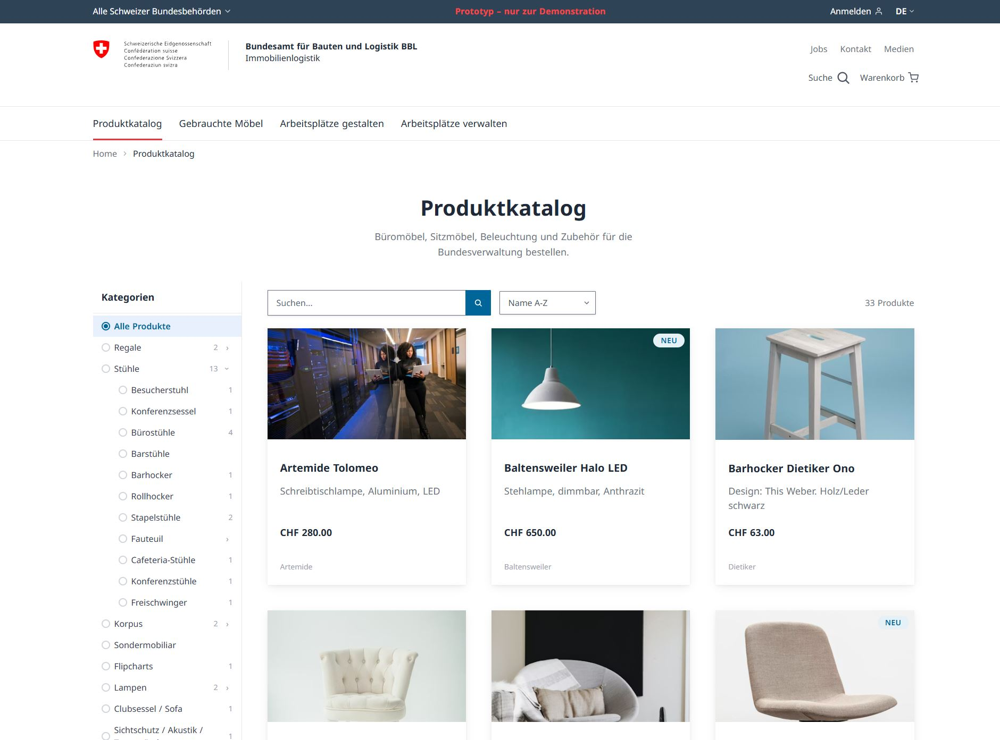
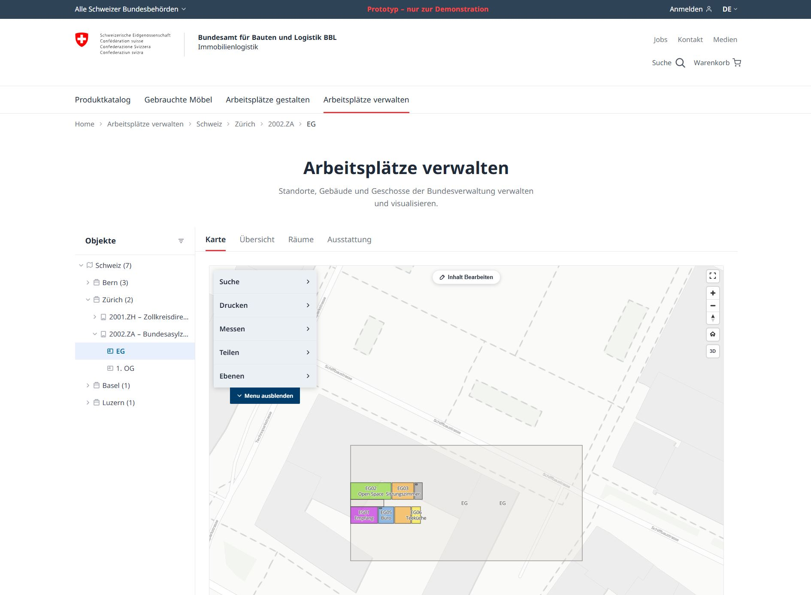

# BBL Workspace Management

[](https://bbl-dres.github.io/workspace-management/)


-blue)

> [!CAUTION]
> **This is an unofficial mockup for demonstration purposes only.**
> All data is fictional. Not all features are fully functional. This project serves as a visual and conceptual prototype — it is not intended for production use.

A single-page application (SPA) prototype for the Swiss Federal Office for Buildings and Logistics (BBL). It manages workspace infrastructure — furniture ordering, office planning, circular economy, and building occupancy.

<p align="center">
  
  
</p>

## Tech Stack

- **Vanilla HTML / CSS / JavaScript** — no frameworks or build tools
- **MapLibre GL JS** for interactive building maps
- **Swisstopo Geocoding API** (`geo.admin.ch`) for address search
- **CartoDB Basemaps** (Positron, Voyager, Dark Matter)
- **Hash-based routing** (`#/shop`, `#/occupancy/building-id`, etc.)
- **Static JSON / GeoJSON data** in `data/` — no backend required

## Modules

### Product Catalog

| Route | Description |
|---|---|
| `#/shop` | Hierarchical category tree, search, sort, filters |
| `#/product/:id` | Product detail page |
| `#/cart` | Shopping cart |
| `#/search` | Global search across products and content |

### Circular Economy

| Route | Description |
|---|---|
| `#/circular` | Browse used furniture available for reuse |
| `#/item/:itemId` | Furniture item detail page |
| `#/scan` | Scan furniture for identification |
| `#/register` | Register used furniture for reuse |
| `#/charter` | Circular economy charter / agreement |

### Workspace Planning

| Route | Description |
|---|---|
| `#/planning` | Overview of planning resources |
| `#/style-worlds` | Style world inspirations |
| `#/examples` | Planning examples |
| `#/cad` | CAD file downloads |

### Occupancy Planning

| Route | Description |
|---|---|
| `#/occupancy` | Spatial tree (Country > Canton > Building > Floor), interactive map with building markers, metrics tables |
| `#/occupancy/:buildingId` | Building-specific occupancy view |
| `#/occupancy/:buildingId/:tabId` | Building view with a specific tab selected |

## Map Features

The occupancy map includes:

- **Navigation controls** (zoom, home, 3D toggle) — right side, vertically centered
- **Address search** — click-to-expand input (Swisstopo geocoding API)
- **Background switcher** — Light (Positron), Standard (Voyager), Dark (Dark Matter)
- **Scale bar** (bottom-left)
- **Persistent map style** via URL parameter (`?bg=positron`)
- **Building footprints & markers** with click interaction and popups
- **Floor / room / asset visualization** at building level
- **Measurement tools** — distance and area
- **Furniture editing & placement** — drag-and-drop
- **3D terrain support**
- **Print preview**
- Map survives selection changes (pan/zoom preserved, no reload)

## Project Structure

```
index.html              Single entry point
css/
  tokens.css            Design tokens (colors, spacing, typography)
  style.css             Component and layout styles
js/
  app.js                Core application logic, routing, data loading
  components.js         Shared component rendering
  pages.js              Page renderers (home, planning, search, etc.)
  shop.js               Shop, product detail, circular economy, cart
  occupancy.js          Occupancy planning, map, furniture editing, measurements
data/
  products.json         Furniture catalog
  categories.json       Product category tree
  buildings.geojson     Building metadata and geometries
  floors.geojson        Floor polygons and metadata
  rooms.geojson         Room geometries with properties
  assets.geojson        Inventory items positioned in rooms
  assets-circular.json  Circular economy listings
  sites.json            Site / canton groupings
  style-worlds.json     Style world inspirations
  planning-examples.json  Planning examples
  cad-files.json        CAD download sections
scripts/
  generate-geojson.js   GeoJSON generator for realistic floor plans (uses Swisstopo elevation API)
docs/
  REQUIREMENTS.md       Functional requirements (German)
  DESIGNGUIDE.md        Design system guide
  DATAMODEL.md          Data model documentation
  Wireframes/           Wireframes and reference designs
assets/
  Preview1.jpg          Application screenshot
  Preview2.jpg          Application screenshot
  swiss-logo-name.svg   Swiss Confederation text logo
  swiss-logo-flag.svg   Swiss flag
```

## Running

Open `index.html` in a browser. No build step required.

## Design System

Follows the modern Swiss Confederation Corporate Design (CD Bund) with the Noto Sans typeface. See [DESIGNGUIDE.md](docs/DESIGNGUIDE.md) for details.

## Documentation

- [REQUIREMENTS.md](docs/REQUIREMENTS.md) — Functional requirements (German)
- [DESIGNGUIDE.md](docs/DESIGNGUIDE.md) — Design system guide
- [DATAMODEL.md](docs/DATAMODEL.md) — Data model documentation

> [!CAUTION]
> **This is an unofficial mockup for demonstration purposes only.**
> All data is fictional. Not all features are fully functional. This project serves as a visual and conceptual prototype — it is not intended for production use.
