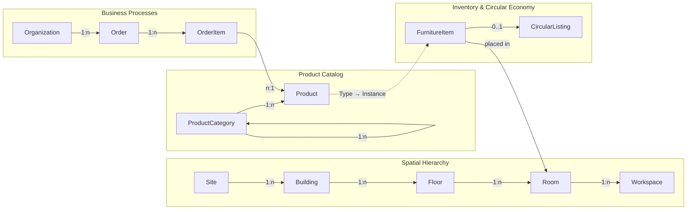
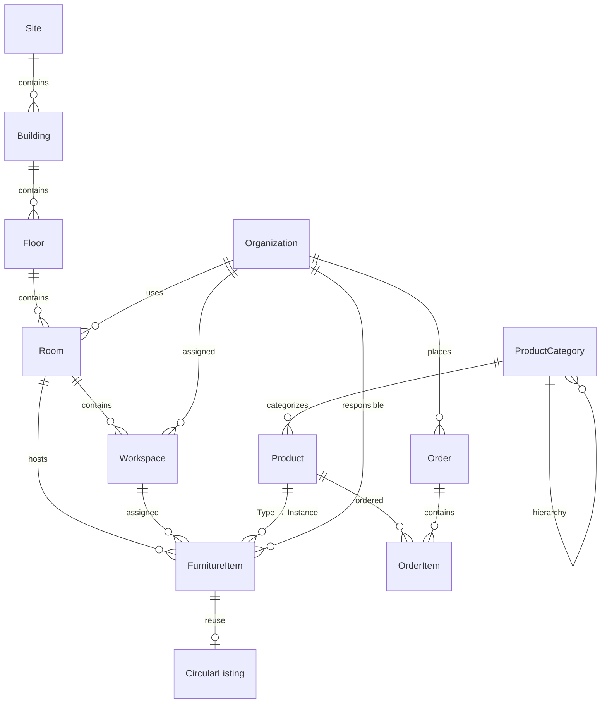

# DATAMODEL.md — Workspace Management Data Model

> Data model for the BBL Workspace Management Platform.
> Aligned with IFC 4.3 (buildingSMART), ArcGIS Indoors, Archilogic Space API,
> BuildingMinds, and CAFM conventions.

---

## Overview

### Entities

| Entity             | Description                                   | DE Term                      | Data Source (Prototype)      | IFC 4.3 Equivalent     |
|--------------------|-----------------------------------------------|------------------------------|------------------------------|------------------------|
| **Site**           | Location / campus area                        | Standort / Areal             | `data/sites.json`            | IfcSite                |
| **Building**       | Building / property                           | Gebäude / Liegenschaft       | `data/buildings.json`        | IfcBuilding            |
| **Floor**          | Storey / level                                | Geschoss / Stockwerk         | `data/floors.json`           | IfcBuildingStorey      |
| **Room**           | Room (smallest spatial unit)                  | Raum                         | Embedded in floors.json      | IfcSpace               |
| **Workspace**      | Workspace within a room                       | Arbeitsplatz                 | Counter only (`workspaces`)  | —                      |
| **ProductCategory**| Hierarchical product category                 | Produktkategorie             | `data/categories.json`       | IfcClassificationRef   |
| **Product**        | Catalog item (orderable)                      | Katalogartikel               | `data/products.json`         | IfcFurnitureType       |
| **FurnitureItem**  | Inventory object (physical furniture piece)   | Inventarobjekt / Möbelstück  | `data/furniture-items.json`  | IfcFurniture           |
| **CircularListing**| Circular economy listing (reuse)              | Kreislauf-Angebot            | Derived from FurnitureItem   | —                      |
| **Organization**   | Federal agency / organizational unit          | Bundesstelle                 | Free text in checkout        | —                      |
| **Order**          | Order from the catalog                        | Bestellung                   | `state.cart` + checkout      | —                      |
| **OrderItem**      | Single order line item                        | Bestellposition              | `state.cart[]`               | —                      |

### Domain Model



---

## 1. Spatial Hierarchy

The spatial hierarchy forms the backbone of occupancy planning. It follows the
IFC principle `IfcSite → IfcBuilding → IfcBuildingStorey → IfcSpace` and extends
it with a Workspace level for desk management.

### 1.1 Site (Standort)

A site encompasses an area or property with one or more buildings. In the Swiss
federal administration, this typically represents an address group or campus.

| Attribute        | Type       | Required | Description                                      | DE Term                | Reference              |
|------------------|------------|----------|--------------------------------------------------|------------------------|------------------------|
| `siteId`         | string     | ✓        | Unique ID (e.g. `"ch"`, `"be"`)                  | Standort-ID            | ArcGIS `SITE_ID`       |
| `siteCode`       | string     |          | BBL internal site code                            | Standortcode           | BuildingMinds `siteCode` |
| `name`           | string     | ✓        | Display name (e.g. `"Bern"`)                     | Bezeichnung            | IFC `Name`             |
| `nameLong`       | string     |          | Long name (e.g. `"Verwaltungsstandort Bern"`)     | Langname               | ArcGIS `NAME_LONG`     |
| `type`           | enum       | ✓        | Site type                                         | Standorttyp            | BuildingMinds `type`   |
| `address`        | Address    |          | Postal address (embedded)                         | Postadresse            | BuildingMinds `addressIds` |
| `coords`         | [lat, lng] |          | WGS84 coordinates                                 | Koordinaten            | —                      |
| `buildingCount`  | integer    |          | Number of buildings (derived)                     | Anzahl Gebäude         | —                      |
| `validFrom`      | date       |          | Valid from                                        | Gültig ab              | BuildingMinds          |
| `validUntil`     | date       |          | Valid until                                       | Gültig bis             | BuildingMinds          |

**Enum `SiteType`:**

| Value (EN)              | Value (DE)              |
|-------------------------|-------------------------|
| Administrative site     | Verwaltungsstandort     |
| Military site           | Militärstandort         |
| Educational site        | Bildungsstandort        |
| Special-purpose site    | Spezialstandort         |
| Other                   | Andere                  |

**Prototype mapping:** Corresponds to the canton nodes in `LOCATIONS` (`be`, `zh`, `bs`, `lu`).
In a real model, the country node (`ch`) would be a top-level filter, not a Site.

---

### 1.2 Building (Gebäude)

A building is a single built structure with its own object code, address, and
year of construction.

| Attribute        | Type       | Required | Description                                      | DE Term                | Reference              |
|------------------|------------|----------|--------------------------------------------------|------------------------|------------------------|
| `buildingId`     | string     | ✓        | Unique ID (e.g. `"b-001"`)                       | Gebäude-ID             | ArcGIS `FACILITY_ID`   |
| `siteId`         | string     | ✓        | FK → Site                                         | Standort-FK            | ArcGIS `SITE_ID`       |
| `name`           | string     | ✓        | Display name (e.g. `"Bundeshaus Ost"`)            | Bezeichnung            | IFC `Name`             |
| `objectCode`     | string     | ✓        | BBL object code (e.g. `"1502.AB"`)                | Objekt-Nr.             | BBL-specific           |
| `address`        | Address    | ✓        | Full postal address                               | Postadresse            | —                      |
| `coords`         | [lat, lng] |          | WGS84 coordinates (building centroid)             | Koordinaten            | —                      |
| `yearBuilt`      | string     |          | Year / period of construction (e.g. `"1892"`)     | Baujahr / Bauperiode   | BBL `Bauperiode`       |
| `status`         | enum       | ✓        | Building status                                   | Gebäudestatus          | BBL-specific           |
| `category`       | enum       | ✓        | Building category                                 | Gebäudekategorie       | BBL-specific           |
| `areaGross`      | number     |          | Gross floor area in m² (e.g. `12450`)             | Bruttogeschossfläche   | IFC `GrossFloorArea`   |
| `heightRelative` | number     |          | Building height in m                              | Gebäudehöhe            | ArcGIS `HEIGHT_RELATIVE` |
| `floorCount`     | integer    |          | Number of storeys (derived)                       | Anzahl Geschosse       | —                      |
| `photo`          | string     |          | Image URL / Unsplash ID                           | Bild-URL               | Prototype              |
| `validFrom`      | date       |          | Valid from                                        | Gültig ab              | BuildingMinds          |
| `validUntil`     | date       |          | Valid until                                       | Gültig bis             | BuildingMinds          |
| `extensionData`  | json       |          | Custom fields for client-specific attributes      | Freifelder             | BuildingMinds          |

**Enum `BuildingStatus`:**

| Value (EN)         | Value (DE)           |
|--------------------|----------------------|
| Existing           | Gebäude bestehend    |
| Under construction | Im Bau               |
| Planned            | Geplant              |
| Renovation         | Sanierung            |
| Demolition         | Rückbau              |
| Decommissioned     | Stillgelegt          |

**Enum `BuildingCategory`:**

| Value (EN)            | Value (DE)              |
|-----------------------|-------------------------|
| Administrative        | Verwaltungsgebäude      |
| Special-purpose       | Spezialgebäude          |
| Residential           | Wohngebäude             |
| Storage               | Lagergebäude            |
| Technical             | Technisches Gebäude     |
| Mixed-use             | Mischnutzung            |
| Other                 | Andere                  |

**Object code format:** `{Wirtschaftseinheit}.{BuildingLetters}` — e.g. `1502.AB`.
The Wirtschaftseinheit is a BBL-internal economic unit identifier, the letters
uniquely identify each building within that unit.

**Prototype mapping:** Direct 1:1 correspondence to the Building nodes in `LOCATIONS`.

---

### 1.3 Floor (Geschoss / Stockwerk)

A floor represents a horizontally bounded level within a building.
Follows the IFC principle of `IfcBuildingStorey` with explicit storey ordering.

| Attribute        | Type       | Required | Description                                      | DE Term                | Reference              |
|------------------|------------|----------|--------------------------------------------------|------------------------|------------------------|
| `floorId`        | string     | ✓        | Unique ID (e.g. `"b-001-eg"`)                    | Geschoss-ID            | ArcGIS `LEVEL_ID`      |
| `buildingId`     | string     | ✓        | FK → Building                                     | Gebäude-FK             | ArcGIS `FACILITY_ID`   |
| `name`           | string     | ✓        | Display name (e.g. `"1. OG"`)                    | Anzeigename            | ArcGIS `NAME`          |
| `nameShort`      | string     | ✓        | Short name for floor filters (e.g. `"1"`)         | Kurzname               | ArcGIS `NAME_SHORT`    |
| `levelNumber`    | integer    | ✓        | Building-specific level number (e.g. `0` = GF)    | Geschossnummer         | ArcGIS `LEVEL_NUMBER`  |
| `verticalOrder`  | integer    | ✓        | 0-based ordering: GF=0, basement<0, upper>0       | Vertikale Ordnung      | ArcGIS `VERTICAL_ORDER`|
| `areaGross`      | number     |          | Gross floor area in m² (e.g. `2650`)              | Bruttogeschossfläche   | ArcGIS `AREA_GROSS`    |
| `heightRelative` | number     |          | Storey height in m (e.g. `3.50`)                  | Geschosshöhe           | ArcGIS/IFC             |
| `workspaceCount` | integer    |          | Number of workspaces (derived or stored)          | Anzahl Arbeitsplätze   | Prototype              |
| `roomCount`      | integer    |          | Number of rooms (derived or stored)               | Anzahl Räume           | Prototype              |
| `rooms`          | Room[]     |          | Array of rooms on this floor                      | Räume                  | Prototype              |
| `floorPlanUrl`   | string     |          | URL to 2D floor plan image (SVG/PNG)              | Grundriss-URL          | Archilogic Export      |
| `floorPlanGeojson`| string    |          | URL to GeoJSON room layout                        | Grundriss-GeoJSON      | Archilogic GeoJSON     |
| `bimModelUrl`    | string     |          | URL to IFC/glTF 3D model                          | BIM-Modell-URL         | Archilogic Export      |

**`levelNumber` vs `verticalOrder`:** ArcGIS Indoors distinguishes between
the building-specific level number (`LEVEL_NUMBER`, e.g. for elevator displays)
and the sortable order (`VERTICAL_ORDER`). In Swiss buildings with
UG/EG/OG designations (basement/ground/upper), this separation is useful:
`levelNumber` can represent the official BBL floor designation, while
`verticalOrder` serves sorting and navigation.

**Swiss floor naming convention:**

| Name   | DE Term             | `levelNumber` | `verticalOrder` |
|--------|---------------------|---------------|-----------------|
| UG     | Untergeschoss       | -1            | -1              |
| EG     | Erdgeschoss         | 0             | 0               |
| 1. OG  | 1. Obergeschoss     | 1             | 1               |
| 2. OG  | 2. Obergeschoss     | 2             | 2               |
| 3. OG  | 3. Obergeschoss     | 3             | 3               |

**Prototype mapping:** Direct 1:1 correspondence to Floor nodes in `LOCATIONS`.
Rooms are embedded as an array within each floor record in `data/floors.json`.

**Floor plan note:** The prototype shows a map placeholder in the "Karte" tab.
In the target architecture, this would reference either a static SVG (`floorPlanUrl`),
an interactive GeoJSON floor plan (`floorPlanGeojson`), or a 3D model
(`bimModelUrl`), comparable to the Archilogic Floor Plan Engine
or the BuildingMinds 3D viewer.

---

### 1.4 Room (Raum)

A room is the smallest spatial unit — a physically bounded area within a floor.
Corresponds to `IfcSpace` / ArcGIS `Units` / Archilogic `Space`.

| Attribute        | Type       | Required | Description                                      | DE Term                | Reference              |
|------------------|------------|----------|--------------------------------------------------|------------------------|------------------------|
| `roomId`         | string     | ✓        | Unique ID (e.g. `"b-001-eg-101"`)                | Raum-ID                | ArcGIS `UNIT_ID`       |
| `floorId`        | string     | ✓        | FK → Floor                                        | Geschoss-FK            | ArcGIS `LEVEL_ID`      |
| `name`           | string     | ✓        | Room number (e.g. `"EG01"`)                       | Raumnummer             | IFC `Name`             |
| `nameLong`       | string     |          | Long name (e.g. `"Reception Ground Floor"`)       | Langname               | IFC `LongName`         |
| `useType`        | enum       | ✓        | Room use type                                     | Raumnutzungstyp        | IFC `ObjectType`, ArcGIS `USE_TYPE` |
| `areaGross`      | number     |          | Room area in m² (e.g. `28.5`)                     | Raumfläche             | ArcGIS `AREA_GROSS`    |
| `heightRelative` | number     |          | Clear room height in m                            | Lichte Raumhöhe        | ArcGIS `HEIGHT_RELATIVE`|
| `capacity`       | integer    |          | Maximum occupancy / workspaces                    | Kapazität              | IFC `Pset_SpaceOccupancyRequirements` |
| `isBookable`     | boolean    |          | Room is bookable (meeting rooms etc.)             | Buchbar                | BuildingMinds Booking  |
| `occupancy`      | enum       |          | Occupancy status                                  | Belegungsstatus        | CAFM                   |
| `organizationId` | string     |          | FK → Organization (assigned tenant)               | Organisation-FK        | CAFM                   |
| `geometry`       | GeoJSON    |          | Polygon geometry of the room                      | Geometrie              | Archilogic/ArcGIS      |
| `extensionData`  | json       |          | Custom fields                                     | Freifelder             | BuildingMinds          |

**Enum `RoomUseType`** (aligned with SIA 416 / DIN 277):

| Value (EN)         | Value (DE)           |
|--------------------|----------------------|
| Office             | Büro                 |
| Meeting room       | Sitzungszimmer       |
| Open space         | Open Space           |
| Reception          | Empfang              |
| Kitchenette        | Teeküche             |
| WC                 | WC                   |
| Corridor           | Korridor             |
| Storage            | Lager                |
| Technical room     | Technikraum          |
| Cloakroom          | Garderobe            |
| Print room         | Druckerraum          |
| Focus room         | Fokusraum            |
| Lounge             | Lounge               |
| Cafeteria          | Cafeteria            |
| Training room      | Schulungsraum        |
| Archive            | Archiv               |
| Other              | Andere               |

**Enum `OccupancyStatus`:**

| Value (EN)         | Value (DE)           |
|--------------------|----------------------|
| Vacant             | Frei                 |
| Partially occupied | Teilbelegt           |
| Fully occupied     | Vollbelegt           |
| Blocked            | Gesperrt             |
| Under renovation   | Sanierung            |

**Prototype mapping:** Rooms are stored as embedded arrays in `data/floors.json`.
Each room has `nr` (room number), `type` (use type), `area` (m²), and
`workspaces` (workspace count). In the target architecture, rooms would be
persisted as independent entities with full geometry.

---

### 1.5 Workspace (Arbeitsplatz)

A workspace is the finest functional unit — an individual desk or station within
a room that can be assigned to a person or function. This concept originates
from CAFM systems and the BuildingMinds workspace management feature.

| Attribute        | Type       | Required | Description                                      | DE Term                | Reference              |
|------------------|------------|----------|--------------------------------------------------|------------------------|------------------------|
| `workspaceId`    | string     | ✓        | Unique ID (e.g. `"ws-001-eg-101-a"`)             | Arbeitsplatz-ID        | CAFM                   |
| `roomId`         | string     | ✓        | FK → Room                                         | Raum-FK                | —                      |
| `name`           | string     | ✓        | Display name (e.g. `"Desk A"`)                    | Bezeichnung            | —                      |
| `workspaceType`  | enum       | ✓        | Workspace type                                    | Arbeitsplatztyp        | BuildingMinds Work Area|
| `isAssigned`     | boolean    |          | Permanently assigned?                             | Fest zugewiesen        | CAFM                   |
| `assignedTo`     | string     |          | Personnel number / name of assigned person         | Zugewiesene Person     | CAFM                   |
| `organizationId` | string     |          | FK → Organization                                  | Organisation-FK        | CAFM                   |
| `equipment`      | string[]   |          | List of assigned FurnitureItem IDs                 | Ausstattung            | —                      |
| `position`       | {x, y}    |          | Position in floor plan (pixels or meters)          | Position               | Archilogic Asset       |
| `rotation`       | number     |          | Rotation in degrees                                | Rotation               | Archilogic Asset       |

**Enum `WorkspaceType`** (aligned with BBL workspace standards):

| Value (EN)              | Value (DE)                |
|-------------------------|---------------------------|
| Focus workspace         | Fokus-Arbeitsplatz        |
| Flex workspace          | Flex-Arbeitsplatz         |
| Sit-stand workspace     | Steh-Sitz-Arbeitsplatz    |
| Meeting seat            | Besprechungsplatz         |
| Lounge seat             | Lounge-Platz              |
| Hot desk                | Hotdesk                   |
| Phone booth             | Telefonkabine             |
| Other                   | Andere                    |

**Prototype mapping:** In the prototype, workspaces exist as a `workspaces`
counter at floor/room level but are not modeled as independent entities.

---

## 2. Product Catalog

### 2.1 ProductCategory

Hierarchical categorization of the furniture catalog. Supports up to 3 levels.

| Attribute        | Type       | Required | Description                                      | DE Term                |
|------------------|------------|----------|--------------------------------------------------|------------------------|
| `categoryId`     | string     | ✓        | Unique ID (e.g. `"stuehle"`)                     | Kategorie-ID           |
| `parentId`       | string     |          | FK → ProductCategory (null = root category)       | Eltern-FK              |
| `label`          | string     | ✓        | Display name (e.g. `"Stühle"`)                   | Anzeigename            |
| `sortOrder`      | integer    |          | Sort position within level                        | Sortierposition        |

**Prototype mapping:** Direct 1:1 correspondence to `categories.json`.
The hierarchical nesting (`children`) is modeled via `parentId`.

---

### 2.2 Product (Katalogartikel)

A catalog item in the BBL standard assortment — an orderable furniture type
with price and availability.

| Attribute        | Type       | Required | Description                                      | DE Term                |
|------------------|------------|----------|--------------------------------------------------|------------------------|
| `productId`      | integer    | ✓        | Unique ID                                         | Produkt-ID             |
| `name`           | string     | ✓        | Product name (e.g. `"Bürostuhl Giroflex 64"`)     | Produktbezeichnung     |
| `description`    | string     |          | Short description                                 | Kurzbeschreibung       |
| `brand`          | string     | ✓        | Brand / manufacturer (e.g. `"Giroflex"`)           | Marke / Hersteller     |
| `categoryId`     | string     | ✓        | FK → ProductCategory (main category)               | Hauptkategorie-FK      |
| `subcategoryId`  | string     |          | FK → ProductCategory (subcategory)                 | Unterkategorie-FK      |
| `price`          | number     | ✓        | Price in base currency (excl. VAT)                 | Preis                  |
| `currency`       | string     | ✓        | ISO currency code (default `"CHF"`)                | Währung                |
| `isNew`          | boolean    |          | Marked as "New"                                    | Neu                    |
| `isCircular`     | boolean    |          | Used furniture (circular economy)                  | Kreislaufwirtschaft    |
| `imageUrl`       | string     |          | Product image URL                                  | Produktbild-URL        |
| `dimensions`     | Dimensions |          | Dimensions (W×D×H cm)                              | Abmessungen            |
| `weight`         | number     |          | Weight in kg                                       | Gewicht                |
| `material`       | string     |          | Primary material (e.g. `"Fabric Anthracite"`)      | Hauptmaterial          |
| `color`          | string     |          | Color                                              | Farbe                  |
| `articleNumber`  | string     |          | Manufacturer article number                        | Herstellerartikelnr.   |
| `availability`   | enum       |          | Availability status                                | Verfügbarkeitsstatus   |
| `leadTimeDays`   | integer    |          | Lead time in business days                         | Lieferfrist            |

**Embedded `Dimensions`:**
```
{ width: number, depth: number, height: number, unit: "cm" }
```

**Enum `Availability`:**

| Value (EN)              | Value (DE)              |
|-------------------------|-------------------------|
| Available               | Verfügbar               |
| Limited availability    | Begrenzt verfügbar      |
| On request              | Auf Anfrage             |
| Unavailable             | Nicht verfügbar         |

**Prototype mapping:** Direct 1:1 correspondence to `products.json`.
The fields `dimensions`, `weight`, `material`, `color`, `articleNumber`,
`leadTimeDays` are extensions beyond the current prototype.

---

## 3. Inventory & Circular Economy

### 3.1 FurnitureItem (Inventarobjekt)

A physical instance of a product — a specific furniture piece located at a
particular place that is inventoried. Corresponds to the IFC concept
`IfcFurniture` or Archilogic `Asset`.

| Attribute        | Type       | Required | Description                                      | DE Term                | Reference              |
|------------------|------------|----------|--------------------------------------------------|------------------------|------------------------|
| `itemId`         | string     | ✓        | Unique ID (e.g. `"INV-2024-001234"`)             | Inventar-ID            | IFC `GlobalId`         |
| `productId`      | integer    |          | FK → Product (catalog reference, if assignable)    | Produkt-FK             | IFC `IsTypedBy`        |
| `name`           | string     | ✓        | Display name (e.g. `"Bürostuhl Giroflex 64"`)     | Bezeichnung            | IFC `Name`             |
| `inventoryNumber`| string     | ✓        | BBL inventory number (e.g. `"INV-2024-001234"`)   | Inventarnummer         | CAFM                   |
| `serialNumber`   | string     |          | Manufacturer serial number                         | Seriennummer           | —                      |
| `brand`          | string     |          | Brand (redundant if productId is set)              | Marke                  | —                      |
| `categoryId`     | string     |          | FK → ProductCategory                               | Kategorie-FK           | —                      |
| `roomId`         | string     |          | FK → Room (current location)                       | Raum-FK                | IFC `ContainedInSpatialStructure` |
| `workspaceId`    | string     |          | FK → Workspace (if assigned)                       | Arbeitsplatz-FK        | —                      |
| `status`         | enum       | ✓        | Current status                                     | Status                 | CAFM                   |
| `condition`      | enum       |          | Physical condition                                 | Zustand                | Prototype              |
| `acquisitionDate`| date       |          | Acquisition date                                   | Beschaffungsdatum      | CAFM                   |
| `acquisitionCost`| number     |          | Acquisition cost CHF                                | Beschaffungspreis      | CAFM                   |
| `organizationId` | string     |          | FK → Organization (responsible agency)              | Organisation-FK        | CAFM                   |
| `position`       | {x, y}    |          | Position in floor plan                              | Position               | Archilogic Asset       |
| `rotation`       | number     |          | Rotation in degrees                                 | Rotation               | Archilogic Asset       |
| `qrCode`         | string     |          | QR code content (URL or inventory number)           | QR-Code                | Prototype "Scan"       |
| `notes`          | string     |          | Notes                                               | Bemerkungen            | —                      |

**Enum `FurnitureStatus`:**

| Value (EN)         | Value (DE)           |
|--------------------|----------------------|
| Active             | Aktiv                |
| In storage         | Eingelagert          |
| For disposal       | Zur Abgabe           |
| Reserved           | Reserviert           |
| In transfer        | Im Transfer          |
| Disposed           | Entsorgt             |

**Enum `FurnitureCondition`:**

| Value (EN)         | Value (DE)           |
|--------------------|----------------------|
| Very good          | Sehr gut             |
| Good               | Gut                  |
| Acceptable         | Akzeptabel           |
| Needs repair       | Reparaturbedürftig   |
| Defective          | Defekt               |

**Prototype mapping:** In the prototype, FurnitureItems exist implicitly via
the "Record object" and "Scan object" functions in the circular section.
The inventory number (`INV-2024-001234`) is the primary identifier.

---

### 3.2 CircularListing (Kreislauf-Angebot)

When a furniture item is released for reuse, a circular listing is created —
comparable to a posting in an internal marketplace.

| Attribute        | Type       | Required | Description                                      | DE Term                |
|------------------|------------|----------|--------------------------------------------------|------------------------|
| `listingId`      | string     | ✓        | Unique ID                                         | Angebots-ID            |
| `itemId`         | string     | ✓        | FK → FurnitureItem                                 | Inventar-FK            |
| `offeredBy`      | string     | ✓        | FK → Organization (offering agency)                | Anbietende Stelle      |
| `price`          | number     |          | Transfer price CHF (0 = free transfer)             | Abgabepreis            |
| `condition`      | enum       | ✓        | Condition at time of listing                       | Zustand                |
| `description`    | string     |          | Free text description                              | Beschreibung           |
| `photos`         | string[]   |          | Image URLs                                         | Bilder                 |
| `listingStatus`  | enum       | ✓        | Listing status                                     | Angebotsstatus         |
| `listedAt`       | datetime   | ✓        | Creation date                                      | Erstellt am            |
| `expiresAt`      | datetime   |          | Expiration date                                    | Ablaufdatum            |

**Enum `ListingStatus`:**

| Value (EN)         | Value (DE)           |
|--------------------|----------------------|
| Active             | Aktiv                |
| Reserved           | Reserviert           |
| Awarded            | Vergeben             |
| Expired            | Abgelaufen           |
| Withdrawn          | Zurückgezogen        |

**Prototype mapping:** In the prototype, used furniture items are filtered via
the `isCircular` flag in `products.json`. In the target architecture, a
CircularListing would be a separate entity referencing a specific FurnitureItem.

---

## 4. Business Processes

### 4.1 Organization (Bundesstelle)

An organizational unit of the Swiss federal administration acting as client and
user of spaces and furniture.

| Attribute        | Type       | Required | Description                                      | DE Term                |
|------------------|------------|----------|--------------------------------------------------|------------------------|
| `organizationId` | string     | ✓        | Unique ID                                         | Organisation-ID        |
| `name`           | string     | ✓        | Name (e.g. `"Bundesamt für Bauten und Logistik"`) | Bezeichnung            |
| `abbreviation`   | string     |          | Abbreviation (e.g. `"BBL"`)                       | Kurzform               |
| `department`     | string     |          | Parent department (e.g. `"EFD"`)                   | Departement            |
| `costCenter`     | string     |          | Cost center (e.g. `"KST-4200-001"`)               | Kostenstelle           |
| `contactName`    | string     |          | Contact person                                     | Kontaktperson          |
| `contactEmail`   | string     |          | Contact email                                      | E-Mail                 |
| `billingAddress` | Address    |          | Billing address                                    | Rechnungsadresse       |

**Prototype mapping:** Captured as free text fields in the checkout form
("Bundesstelle / Organisation", "Kostenstelle", "Kontaktperson", "E-Mail").

---

### 4.2 Order (Bestellung)

An order placed by a client (federal agency) from the product catalog.

| Attribute        | Type       | Required | Description                                      | DE Term                |
|------------------|------------|----------|--------------------------------------------------|------------------------|
| `orderId`        | string     | ✓        | Unique order number                                | Bestellnummer          |
| `organizationId` | string     | ✓        | FK → Organization (orderer)                        | Besteller-FK           |
| `orderDate`      | datetime   | ✓        | Order timestamp                                    | Bestellzeitpunkt       |
| `status`         | enum       | ✓        | Order status                                       | Bestellstatus          |
| `billingAddress` | Address    | ✓        | Billing address                                    | Rechnungsadresse       |
| `deliveryAddress`| DeliveryAddress | ✓   | Delivery address incl. building/room               | Lieferadresse          |
| `deliveryNotes`  | string     |          | Delivery instructions                              | Lieferhinweise         |
| `totalAmount`    | number     |          | Total amount excl. VAT (derived)                   | Gesamtbetrag           |
| `currency`       | string     | ✓        | ISO currency code (`"CHF"`)                         | Währung                |
| `costCenter`     | string     |          | Cost center for billing                             | Kostenstelle           |
| `orderedBy`      | string     |          | Name of the ordering person                         | Besteller              |
| `orderedByEmail` | string     |          | Email of the ordering person                        | Besteller-E-Mail       |

**Enum `OrderStatus`:**

| Value (EN)         | Value (DE)           |
|--------------------|----------------------|
| Draft              | Entwurf              |
| Submitted          | Übermittelt          |
| In progress        | In Bearbeitung       |
| Partially delivered| Teilgeliefert        |
| Delivered          | Geliefert            |
| Completed          | Abgeschlossen        |
| Cancelled          | Storniert            |

**Embedded `DeliveryAddress`:**
```
{
  buildingId:   string     // FK → Building (optional)
  buildingName: string     // Free text if Building not linked
  floor:        string     // Floor / room (e.g. "3. OG, Raum 312")
  street:       string
  postalCode:   string
  city:         string
  country:      string     // default "CH"
}
```

**Prototype mapping:** The 3-step checkout (cart → address → submit)
implements the ordering process. Fields are taken directly from the form.

---

### 4.3 OrderItem (Bestellposition)

A single line item within an order.

| Attribute        | Type       | Required | Description                                      | DE Term                |
|------------------|------------|----------|--------------------------------------------------|------------------------|
| `orderItemId`    | string     | ✓        | Unique ID                                         | Positions-ID           |
| `orderId`        | string     | ✓        | FK → Order                                         | Bestell-FK             |
| `productId`      | integer    | ✓        | FK → Product                                       | Produkt-FK             |
| `quantity`       | integer    | ✓        | Order quantity                                     | Bestellmenge           |
| `unitPrice`      | number     | ✓        | Unit price at time of order                        | Stückpreis             |
| `lineTotal`      | number     |          | Line total (quantity × unitPrice, derived)          | Positionsbetrag        |

**Prototype mapping:** Corresponds to `state.cart[]` entries with
`{ productId, quantity }`.

---

## 5. Shared Types

### 5.1 Address (Postadresse)

Embedded object, not a standalone entity.

```
{
  street:      string    // "Bundesgasse 3"
  postalCode:  string    // "3003"
  city:        string    // "Bern"
  canton:      string    // "BE"
  country:     string    // "CH"
}
```

---

## 6. Relationships (Entity-Relationship)



---

## 7. IFC / Prototype Delimitation

The data model deliberately adopts terms and structures from IFC 4.3 without
replicating the full complexity of the BIM standard. The following table shows
the key mapping decisions:

| This Model           | IFC 4.3 Equivalent          | Simplification                        |
|----------------------|-----------------------------|---------------------------------------|
| Site                 | IfcSite                     | No geo-referencing (EPSG)             |
| Building             | IfcBuilding                 | No IfcRelAggregates hierarchy         |
| Floor                | IfcBuildingStorey            | No elevations / Z-values             |
| Room                 | IfcSpace                    | No CompositionType (COMPLEX/PARTIAL)  |
| Workspace            | — (no IFC equivalent)       | CAFM extension                        |
| FurnitureItem        | IfcFurniture                | No geometry (Brep/SweptSolid)         |
| Product              | IfcFurnitureType            | Simplified type definition             |
| ProductCategory      | IfcClassificationReference  | Flat hierarchy instead of IfcClassification |

---

## 8. Data Source Mapping (Current → Target)

| Entity           | Prototype Source                       | Target System (Example)       |
|------------------|----------------------------------------|-------------------------------|
| Site             | `LOCATIONS` canton nodes               | SAP RE-FX / Real Estate Master|
| Building         | `LOCATIONS` building nodes             | SAP RE-FX / Real Estate Master|
| Floor            | `LOCATIONS` floor nodes                | SAP RE-FX + CAD/BIM           |
| Room             | Embedded in `data/floors.json`         | SAP RE-FX + BIM (IFC)         |
| Workspace        | Counter only (`workspaces`)            | CAFM system / Booking tool    |
| Product          | `data/products.json`                   | SAP MM / Catalog API           |
| ProductCategory  | `data/categories.json`                 | SAP MM / Catalog API           |
| FurnitureItem    | Implicit (scan/record functions)       | SAP PM / CAFM system           |
| CircularListing  | `isCircular` flag on Product           | Circular marketplace service   |
| Organization     | Free text in checkout form             | LDAP / Admin Directory         |
| Order            | `state.cart` + checkout                | SAP MM / Order portal          |
| OrderItem        | `state.cart[]` entries                 | SAP MM / Order portal          |

---

## 9. Extension Potential

The following entities are not modeled in the current prototype but would be
relevant for production use:

| Entity               | Description                                     | DE Term                         | Standard Reference      |
|----------------------|-------------------------------------------------|---------------------------------|-------------------------|
| **AreaMeasurement**  | Area metrics (HNF, NNF, VF per SIA 416)        | Flächenkennzahlen               | BuildingMinds, DIN 277  |
| **Booking**          | Room / workspace booking                        | Raum-/Arbeitsplatzbuchung       | BuildingMinds Booking   |
| **MaintenanceTask**  | Maintenance and repair orders                   | Wartungsaufträge                | CAFM / SAP PM           |
| **Document**         | Linked documents (CAD, photos, contracts)       | Verknüpfte Dokumente            | IFC IfcDocumentReference|
| **Detail**           | Architectural elements (walls, doors, windows)  | Architekturelemente             | ArcGIS Indoors `Details`|
| **EnergyRating**     | Building energy rating (GEAK, Minergie)         | Energiebewertung                | BuildingMinds           |
| **FloorPlanLayer**   | Planning layers (furniture, electrical, HVAC)   | Planungsebenen                  | Archilogic Layout       |
| **Person**           | Employees with workspace assignments            | Mitarbeitende                   | LDAP / HR               |
| **Lease**            | Lease contracts and conditions                  | Mietverträge                    | SAP RE-FX               |
